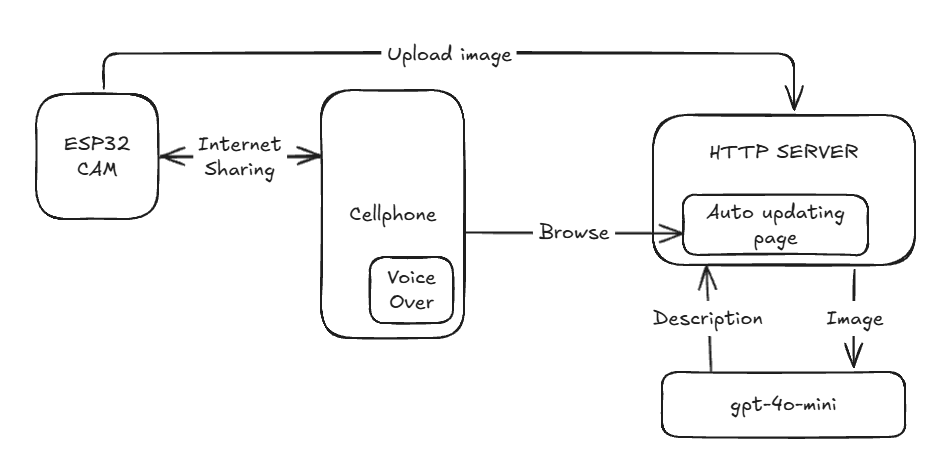
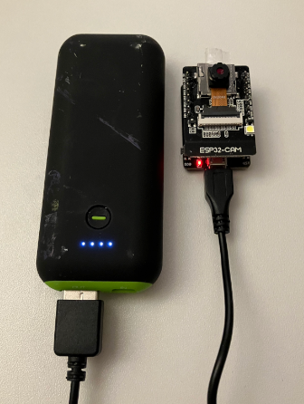

# Introduction

I wanted to see if I could create a low-cost tool for the blind to get  live description of the scene in front of a camera. Since I was going for low cost (<30$), and wanted to learn more about software development on arduino, I bought a ESP32-CAM with built-in WiFi to capture the actual images.

To actually describe the image I selected the gpt-4o-mini model. I didnt think much about which model to use, but this seemed like a good start.

The proof-of-concept solution actually works, but is nowhere near to be a real product since it requires the cell-phone to have a browser opened to a specific page to read the audio descriptions that are updated on a web page.

Security is also not really considered in this project.

## Alternatives

One driving force for creating this tool is how expensive the alternatives are. However alternatives seem to be emerging at the moment so there is hope.


| Product  | Price   | Comment |
|----------|---------|---------|
| Ray-Ban Meta Glasses | $300 | No app available for visual descriptions (yet). Closed API. Can maybe be hacked.|
| EchoVision Smart Glasses | $599 | Interesting product that I need to investigate more | 
| Envision Glasses | $3200 | Google Glass Enterprise Edition 2 hardware |
| OrCam MyEye | $5900 | Clunky solution that you attach to glasses |


## My solution

Use a cell phone with internet sharing enabled that the ESP32-CAM connects to. Then software on the ESP32-CAM uploads images to a HTTP server, which then provides the image the OpenAI API which returns the description of the image. The description is updated on a page in the HTTP server which the cellphone has open.

When new text arrives, the voice-over (for iPhone) reads the updated text to the user.



Setup using a powerbank as battery source for the ESP32-CAM.




## Installing arduino software to ESP32-CAM

The source code for the ESP32-CAM is located in the "esp32" folder. Open it using the Arduino IDE. Update the WiFi credentials and target HTTP server before flashing. Some links that may help with installing the ESP32-CAM drivers.

https://randomnerdtutorials.com/upload-code-esp32-cam-mb-usb/
https://randomnerdtutorials.com/installing-esp32-arduino-ide-2-0/

Set the baud-rate to 115200 in the serial monitor to get the output from the ESP32-CAM.

## Running the HTTP server

Set the OpenAI API KEY as an environment variable before starting the web server. You need to update the server IP:PORT in both templates/index.html and server.py.

Powershell
```powershell
$Env:API_KEY = "sk-proj-BLABLABLA..."
```

Bash
```bash
export API_KEY = "sk-proj-BLABLABLA..."
```

Then the server can be started:

```bash
python server.py
```

If you only want to test prompts for the description of the image, test.py can be used to just send a saved image without involving the ESP32 hardware.
